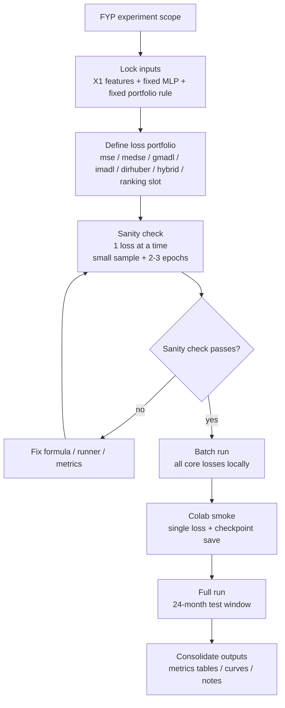
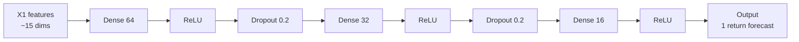
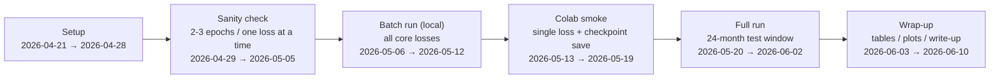

# Experiment Diagrams

> [!summary]
> 这份笔记把当前 FYP 的实验主线收拢成三张图：实验设计流程、MLP 网络结构、时间线。
> 主线顺序固定为：`sanity check -> batch run -> colab smoke -> full run`。

## 0. Loss 主线

| Slot | Loss | 角色 |
|---|---|---|
| 1 | `mse` | 传统基线 |
| 2 | `medse` | 鲁棒基线 |
| 3 | `gmadl` | 方向基线 |
| 4 | `imadl` | 改进 MADL |
| 5 | `dirhuber` | 鲁棒 + 方向 |
| 6 | `hybrid` | 方向 + 精度 + 鲁棒性 |
| 7 | `ranking` / stretch slot | 若时间允许的扩展位 |

> [!note]
> 这里保留 7 个实验槽位，便于和 FYP 的“7-loss 主线”对齐；当前主结果仍以 6 个核心 loss 为主。

## 1. 实验设计流程图

## 2. MLP 网络结构图

> [!tip]
> 这就是当前固定的 baseline MLP：`[64, 32, 16] + ReLU + Dropout 0.2`。

## 3. 时间线可视化

## 4. Source Files

- `doc/diagrams/experiment-flow.mmd`
- `doc/diagrams/mlp-structure.mmd`
- `doc/diagrams/timeline.mmd`

> [!info]
> 如果后续要在别处复用图，只需要直接引用 `doc/diagrams/*.mmd`。
