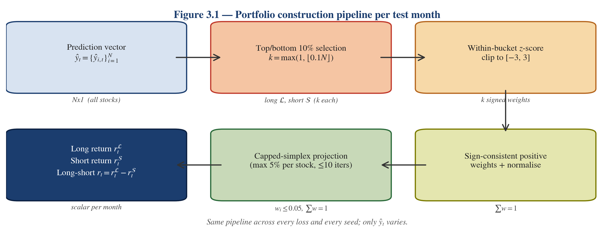

# Chapter 3: Methodology

This chapter describes the pipeline that produces every number reported in Chapter 5. The description is grounded in the actual code under `Model_Train/` and the shared evaluation runner `sanity_check_signal_tilted.py`; where the text differs from older draft material, the code is authoritative.

## 3.1 Research design

The research design is a controlled, single-factor comparison. Data, features, model architecture, training protocol, and portfolio construction are held fixed across every run; the only factor that varies is the loss function used during training. This design gives a clean causal attribution of performance differences to the loss function at the cost of limited external validity across market regimes — a trade-off revisited in §3.8 and in Chapter 6.

The study proceeds in four experimental phases:

- **Baseline.** Seven loss functions covering regression, absolute-loss, and initial multiplicative-hybrid families, evaluated under seed 42 on the static 24-month window.
- **Phase 1.5.** Nine parameterised hybrid variants: additive A1–A5 and multiplicative M1–M4, at the same seed and window.
- **Phase 2.2 γ refinement.** Five values of the robustness parameter γ in the M2-robust family, each evaluated across three random seeds.
- **Integrated Phase 2.** Additional α, β, and λ sweeps evaluated under the same multi-seed protocol; combined into a single grouped summary together with the γ refinement.

A further normalisation probe (Phase 2.2-fix1) and alignment diagnostics (Phase 2.1b, Phase 2.5) delimit the evidence gate described in §3.8. All phases use the same model, feature set, portfolio construction, and evaluation metrics. Chapter 5 presents the empirical results phase by phase.

## 3.2 Model architecture

The model is a fully connected feed-forward neural network (multi-layer perceptron) defined in `Model_Train/models.py`. Its configuration is fixed at:

```python
MLPConfig(
    input_dim=15,
    hidden_dims=[64, 32, 16],
    activation="relu",
    dropout=0.2,
)
```

The architecture comprises an input layer consuming the 15-dimensional X1 feature vector (Chapter 4), three hidden layers of width 64, 32, and 16 respectively with ReLU activations, a dropout layer of rate $p = 0.2$ applied after each ReLU, and a final linear projection to a scalar prediction $\hat y_{i,t}$. The forward pass reduces the final tensor from shape $(N, 1)$ to $(N,)$ by a trailing `squeeze(-1)`; this is the cross-sectional vector of one-month-ahead return predictions consumed by the loss function and by the portfolio construction module.

The hidden-layer widths were selected by a grid search conducted on pre-test data during an earlier phase of the project (`best_hyperparameters.txt` records the winning configuration with training MSE $= 0.02252$). Once the search concluded, the architecture was frozen for every experiment in every phase; no architecture ablation is performed in this report. This design choice follows from the research question: the report measures the marginal effect of the *loss function* conditional on a fixed architecture. A parallel study varying architecture while holding the loss function fixed would answer a different question.

Dropout is active only during training; the evaluation loop sets the model to `eval` mode before forward passes on the test window, so inference is deterministic given the trained weights. The prediction has no output activation; the scalar is used directly by the loss function during training and by the portfolio construction during evaluation.

## 3.3 Loss function families

The loss functions used in this report are defined in `Model_Train/losses.py`. They fall into three families and one combined hybrid family. Each definition below matches the implementation exactly; numerical constants (e.g., `a = 100`, `b = 2`, Huber threshold `delta = 0.01`) are reproduced from the code.

### ==3.3.1 Regression losses== 

**MSE.**
$$
L_{\mathrm{MSE}}(y, \hat y) = \tfrac{1}{N} \textstyle\sum_i (y_i - \hat y_i)^2.
$$
Implemented as the mean of the squared residual; reduction is `mean`.

**MedSE.**
$$
L_{\mathrm{MedSE}}(y, \hat y) = \mathrm{median}_i\big[(y_i - \hat y_i)^2\big].
$$
Implemented by taking the element-wise squared residual and applying `torch.median`; the reduction is `median`. Because the median is non-decomposable across observations, this loss is computed over the full batch per optimisation step.

### 3.3.2 Directional losses (MADL, GMADL, IMADL)

**MADL (differentiable).** The report implements a smooth tanh-based approximation of MADL rather than the step-function form of the original definition:
$$
L_{\mathrm{MADL}}(y, \hat y) = -\tanh(a \cdot y \cdot \hat y) \cdot |y|,
$$
with $a = 25$.

**GMADL.**
$$
L_{\mathrm{GMADL}}(y, \hat y) = -\big[\sigma(a \cdot y \cdot \hat y) - \tfrac12\big] \cdot |y|^b,
$$
with $a = 100$ and $b = 2$.

**IMADL (rebalanced).** IMADL introduces a batch-normalised directional penalty and an additive squared-error magnitude term:
$$
L_{\mathrm{IMADL}}(y, \hat y)
= \lambda_{\mathrm{dir}} \cdot \underbrace{\big[1 - \sigma(a \cdot y \cdot \hat y)\big] \cdot \frac{|y|^b}{\mathbb{E}_{\text{batch}}[|y|^b] + \epsilon}}_{\text{normalised directional penalty}}
\;+\;
\lambda_{\mathrm{mag}} \cdot (y - \hat y)^2,
$$
with $a = 100$, $b = 2$, $\lambda_{\mathrm{dir}} = 1$, $\lambda_{\mathrm{mag}} = 1$ and $\epsilon = 10^{-8}$.

The rebalancing factor $\mathbb{E}_{\text{batch}}[|y|^b]$ is the key architectural choice that separates IMADL from bare GMADL: it normalises the directional term by the current-batch typical magnitude, which reduces the coupling between loss scale and batch composition. Chapter 2 discussed how scale coupling degrades MADL/GMADL convergence near $\hat y \approx 0$; the IMADL formulation is one response to that issue.

### 3.3.3 Hybrid losses: additive and multiplicative

Both hybrid families combine a normalised directional penalty with a Huber magnitude term. The Huber term is
$$
H_\delta(e) =
\begin{cases}
\tfrac12 e^2 & |e| \le \delta, \\
\delta \cdot (|e| - \tfrac12 \delta) & |e| > \delta,
\end{cases}
$$
with $e = y - \hat y$ and $\delta = 0.01$. The directional term is the same batch-normalised penalty used in IMADL:
$$
D(y, \hat y) = \big[1 - \sigma(a \cdot y \cdot \hat y)\big] \cdot \frac{|y|^b}{\mathbb{E}_{\text{batch}}[|y|^b] + \epsilon}.
$$

**Additive hybrid (A-series).**
$$
L_{\mathrm{add}, \lambda_{\mathrm{dir}}, \lambda_{\mathrm{hub}}}(y, \hat y)
= \lambda_{\mathrm{dir}} \cdot D(y, \hat y) + \lambda_{\mathrm{hub}} \cdot H_\delta(y - \hat y).
$$
The five Phase 1.5 A-variants scan two hyperparameters simultaneously (from `LOSS_SPECS` in `losses.py`):

**Table 3.1 — Phase 1.5 additive A-series loss hyperparameters.**

| Variant | $\lambda_{\mathrm{dir}}$ | $\lambda_{\mathrm{hub}}$ |
|---|---:|---:|
| A1 (`hybrid_add_a1`) | 5.0 | 1.0 |
| A2 (`hybrid_add_a2`) | 10.0 | 1.0 |
| A3 (`hybrid_add_a3`) | 1.0 | 0.1 |
| A4 (`hybrid_add_a4`) | 5.0 | 0.1 |
| A5 (`hybrid_add_a5`) | 10.0 | 0.1 |

**Multiplicative hybrid (M-series).**
$$
L_{\mathrm{mul}, \lambda_{\mathrm{dir}}}(y, \hat y)
= \big(1 + \lambda_{\mathrm{dir}} \cdot D(y, \hat y)\big) \cdot H_\delta(y - \hat y).
$$
The four Phase 1.5 M-variants scan only $\lambda_{\mathrm{dir}}$:

**Table 3.2 — Phase 1.5 multiplicative M-series loss hyperparameters.**

| Variant | $\lambda_{\mathrm{dir}}$ |
|---|---:|
| M1 (`hybrid_mul_m1`) | 2.0 |
| M2 (`hybrid_mul_m2`) | 5.0 |
| M3 (`hybrid_mul_m3`) | 0.5 |
| M4 (`hybrid_mul_m4`) | 0.1 |

Intuitively, the multiplicative form treats the Huber magnitude term as a backbone loss and uses the directional penalty as a *gating factor* that up-weights Huber contributions when the direction is predicted incorrectly. When the model predicts direction perfectly, $D \to 0$ and the loss reduces to the plain Huber term; when the direction is incorrect, the loss is amplified by $(1 + \lambda_{\mathrm{dir}} \cdot D)$.

### 3.3.4 M2-robust γ family and related Phase 2 parameterisations

The M2-robust family is a generalisation of the M-series in which the gating factor becomes $\gamma$-parameterised and the Huber backbone is replaced by a smoothly saturating magnitude term. Conceptually, a robust M2 loss takes the form
$$
L_{\mathrm{M2\text{-}robust}, \gamma}(y, \hat y)
= \big(1 + \lambda_{\mathrm{dir}} \cdot D(y, \hat y)\big) \cdot H^{\gamma}(y - \hat y),
$$
where $H^{\gamma}$ is the $\gamma$-controlled robust magnitude term that saturates the contribution of large residuals. Small $\gamma$ flattens the loss surface and prioritises the directional component; large $\gamma$ approaches the Phase 1.5 M2 form. The five values scanned in Chapter 5 Table 5.3 are $\gamma \in \{0.03, 0.05, 0.07, 0.10, 0.15\}$. The integrated Phase 2 summary (Chapter 5 Table 5.4) extends this with finer-grained values $\gamma \in \{0.001, 0.01, 0.10\}$, an IMADL-m2 α sweep (α is the weight on the IMADL-style directional rebalancing, scanned over $\{0.2, 0.3, \ldots, 0.8\}$), an IMADL-GMADL β sweep (β controls the composition of the two directional primitives), and an adaptive-$\lambda$ schedule that modulates the directional weight during training.

The exact implementations of the Phase 2 variants beyond the core Phase 1.5 A/M set live on the `phase2.2-fix` branch alongside the run outputs cited by the grouped summaries. For the evidence used in Chapter 5, the authoritative reference is the grouped summary CSV on that branch (`git show phase2.2-fix:doc/phase2-fix/reports/phase2_grouped_summary.csv`). The design intent in every case is the same as the Phase 1.5 skeleton: a magnitude-controlling backbone combined with a directional-rebalancing factor, parameterised so that a scan can locate the stability peak under multi-seed evaluation.

## 3.4 Training protocol

Each experiment runs the following deterministic protocol (`sanity_check_signal_tilted.run_sanity_check`).

**1. Reproducibility seed.** A single integer seed is provided by the CLI argument `--seed`. It initialises Python's `random`, NumPy's `np.random`, PyTorch's CPU RNG, and — when available — PyTorch's CUDA RNG. All baseline and Phase 1.5 tables in Chapter 5 use `--seed 42`. Phase 2 multi-seed runs use three seeds per row; the exact seed sets are recorded per-run in the phase-specific manifests (not globally).

**2. Device detection.** The runner selects CUDA if available, otherwise MPS on Apple Silicon, otherwise CPU. The all-loss same-window evidence run from Colab uses CUDA; multi-seed Phase 2 runs use CUDA as well. Precision is float32 throughout.

**3. Panel preparation.** `prepare_panel_data(data_dir, pattern)` loads every CSV matching the glob (Chapter 4), parses dates, forward-fills missing `{RET, VOL, SHROUT}` within each `PERMNO`, computes `r`, `to`, and the one-period-ahead target `target_ret`, and returns a long-format panel.

**4. Feature construction.** `build_feature_set_x1` produces the 15-dimensional X1 matrix; `assemble_feature_matrix` packages the features, target, `PERMNO`, and `date` into NumPy arrays. This is the only feature set used in any run that produces a Chapter 5 number.

**5. Train/test masks.** The training mask is $\texttt{train\_start} \le \text{period}(\text{date}) \le \texttt{train\_end}$; the test mask is the set of `test_months` consecutive year-month periods starting at `test_start`. For the final runs, these arguments are `--train-start 1990-01 --train-end 1994-12 --test-start 1995-01 --test-months 24`.

**6. Single training run.** One MLP is instantiated from `MLPConfig` and trained from scratch for exactly `max_epochs = 20` epochs with `batch_size = 1024`. The optimiser is Adam at its PyTorch default settings. There is no weight decay, no learning-rate schedule, no validation-based early stopping, and no gradient clipping. The model is set to `train` mode for each epoch.

**7. Loss selection.** `get_experiment_loss_fn(loss_name)` returns a callable $\ell(y, \hat y)$ with the reduction and hyperparameters listed in §3.3. For MedSE the reduction is `median`; for all others it is `mean`. The training loop computes the per-batch loss, calls `.backward()`, and steps the optimiser once per batch.

**8. Test-period prediction.** After training concludes, the model is set to `eval` mode. For every test month period in sequence, the runner selects that month's cross-section from the feature matrix, calls the model within a `torch.no_grad()` context, and produces the scalar prediction vector $\{\hat y_{i,t}\}$ for that month. No retraining occurs during the test period.

**9. Per-month evaluation.** Each test-month prediction vector is fed to `compute_metrics` (producing MSE, MedSE, R² for that month) and to `compute_portfolio_returns` (producing the long, short, and long-short return for that month; see §3.5). The per-month records form a 24-row CSV `sanity_metrics_{loss}.csv`.

**10. Summary computation.** Once the 24 test months are processed, `compute_long_short_stats` aggregates the monthly long-short series into cumulative return, standard deviation, and annualised Sharpe. The summary JSON `sanity_summary_{loss}.json` is written with a fixed schema.

**11. Verification.** A separate verification step confirms that the metrics CSV has exactly 24 rows with `first_month = 1995-01` and `last_month = 1996-12`. The `*_verification.json` files under `doc/final_report_all_24m_evidence/manifests/` record these checks for every run in the baseline and Phase 1.5 groups.

## 3.5 Portfolio construction

<!-- FIGURE PLACEHOLDER: Fig 3.1
  TYPE: flow diagram (block-and-arrow)
    Five blocks left-to-right (or top-to-bottom):
      1. "Prediction vector ŷ_t (N stocks)"
      2. "Top/bottom 10% bucket selection (k = max(1, floor(0.1 N)))"
      3. "Within-bucket z-score, clipped to [-3, 3]"
      4. "Sign-consistent positive weights + bucket normalisation"
      5. "Capped-simplex projection (max 5% per stock, iterative up to 10 rounds)"
      6. "Long bucket return + Short bucket return -> long-short return r_t"
    Arrows between consecutive blocks; small annotations below each arrow with the shape of the
    tensor at that stage (e.g. "N", "k", "k", "k", "k", "scalar").
  DATA SOURCES: None (this is a schematic of the `compute_portfolio_returns` pipeline).
  CAPTION:
    Figure 3.1 — Portfolio construction pipeline per test month. The same five-step pipeline
    applies to every loss function and every seed; only the prediction vector ŷ_t varies.
-->
**Figure 3.1 — Portfolio construction pipeline.**



Generated by `paper/figures/plot_portfolio_flow.py`. Six blocks: prediction vector $\hat y_t$ → top/bottom 10% bucket selection ($k = \max(1, \lfloor 0.1\,N \rfloor)$) → within-bucket $z$-score clipped to $[-3, 3]$ → sign-consistent positive weights + bucket-level normalisation → capped-simplex projection (5% per-name cap, ≤ 10 iterations) → long, short, and long-short scalar returns. Same pipeline is used for every loss and every seed; only $\hat y_t$ varies. Matches `compute_portfolio_returns` in `sanity_check_signal_tilted.py`.


Portfolio construction is implemented in `compute_portfolio_returns` within `sanity_check_signal_tilted.py`. It takes the cross-sectional prediction vector $\hat y_t = \{\hat y_{i,t}\}_i$ and the corresponding realised-target vector $y_{t+1} = \{y_{i,t+1}\}_i$ for a single month and returns the long, short, and long-short portfolio returns.

**Step 1 — bucket selection.** Let $n = |\hat y_t|$ be the cross-section size and $k = \max(1, \lfloor 0.1 \, n \rfloor)$. The long bucket $\mathcal{L}$ is the set of indices with the $k$ largest predictions; the short bucket $\mathcal{S}$ is the set with the $k$ smallest predictions. The bucket size is therefore always 10% of the cross-section (rounded down) per month.

**Step 2 — within-bucket standardisation.** Within each bucket, the predictions are standardised to $z$-scores using the bucket-local mean and standard deviation. Zero-std buckets are given a zero $z$-vector. The $z$ vector is then clipped to $[-3, 3]$ (the `Z_SCORE_CLIP = 3.0` constant). This step prevents a single extreme prediction from dominating the within-bucket weighting.

**Step 3 — sign-consistent signal-tilted weights.** For the long bucket, the raw weight vector is $w^{\mathcal{L}}_i = \max(z_i, 0)$; for the short bucket, it is $w^{\mathcal{S}}_i = \max(-z_i, 0)$. This ensures the long bucket weights predictions with a positive $z$ more heavily and the short bucket weights predictions with a negative $z$ more heavily. If the weight vector within a bucket is everywhere zero (all $z$ values have the wrong sign), the runner falls back to equal weights within that bucket. The raw weights are then normalised to sum to 1 within the bucket.

**Step 4 — capped-simplex projection.** Each normalised weight vector is projected onto the capped simplex $\{w : w \ge 0, \; w^\top \mathbf{1} = 1, \; w_i \le c\}$ with $c = 0.05$ (the `MAX_WEIGHT` constant). The projection (`apply_weight_cap`) uses an iterative procedure: any weight exceeding $c$ is clipped to $c$, and the excess is redistributed proportionally over the remaining below-cap weights; the process repeats up to 10 times until no weight exceeds $c$. The final weight vector still sums to 1 and satisfies the cap. The cap prevents a single stock from receiving more than 5% of the bucket's exposure.

**Step 5 — bucket and long-short returns.** Each bucket return is the weighted inner product of the capped weight vector with the realised-target vector restricted to the bucket's indices. The long-short return is $r^{\mathcal{L}}_t - r^{\mathcal{S}}_t$.

Two implementation details matter for interpreting the tables in Chapter 5. First, the construction is gross-of-cost: no transaction costs, financing costs, or borrow costs are applied. Second, the long and short legs are treated symmetrically in weighting; the report does not differentiate between positive-skew and negative-skew baskets. Both simplifications are discussed in the limitations section of Chapter 6.

## 3.6 Evaluation metrics

Three categories of metric are reported for every run. The first two are computed per-month and averaged across the 24 test months; the third is computed once over the entire monthly long-short return series.

**Per-month point-prediction metrics** (`compute_metrics`). For each month $t$ and prediction vector $\hat y_t$:
$$
\mathrm{MSE}_t = \tfrac{1}{n_t} \textstyle\sum_i (y_{i,t+1} - \hat y_{i,t})^2,
\qquad
\mathrm{MedSE}_t = \mathrm{median}_i\big[(y_{i,t+1} - \hat y_{i,t})^2\big],
$$
$$
R^2_t = 1 - \frac{\sum_i (y_{i,t+1} - \hat y_{i,t})^2}{\sum_i (y_{i,t+1} - \bar y_{t+1})^2}.
$$
The averages reported in Chapter 5 (`avg_mse`, `avg_medse`, `avg_r2`) are arithmetic means over the 24 monthly values. As documented in Chapter 2 and §5.2, R² can take extremely negative values for losses that do not control prediction magnitude (MedSE, MADL, GMADL). In this report it is read as a diagnostic that points at scale-calibration breakdowns, not as a primary performance metric.

**Per-month portfolio metric.** The monthly long-short return $r^{\mathcal{L}}_t - r^{\mathcal{S}}_t$ from §3.5. `avg_long_short` is its arithmetic mean over the test window.

**Long-short summary statistics** (`compute_long_short_stats`). Given the 24-element monthly long-short series $\{r_s\}_{s=1}^{24}$:
$$
\mathrm{CumRet} = \textstyle\prod_{s=1}^{24}(1 + r_s) - 1,
\qquad
\sigma = \mathrm{stdev}(\{r_s\}),
$$
$$
\mathrm{Sharpe} = \sqrt{12} \cdot \frac{\bar r}{\sigma},
$$
where $\bar r$ is the sample mean. The $\sqrt{12}$ factor annualises the Sharpe from monthly frequency; the factor is explicit in `compute_long_short_stats(periods_per_year=12)`.

For multi-seed Phase 2 rows (Chapter 5 Tables 5.3 and 5.4), the reported summary is the cross-seed average of each quantity together with its cross-seed standard deviation, minimum, and maximum. The stability measure is the coefficient of variation,
$$
\mathrm{CV} = \frac{\mathrm{stdev}(\text{Sharpe across seeds})}{|\text{mean(Sharpe across seeds)}|},
$$
which the Phase 2 grouped summaries store in the `sharpe_cv` column. Because $\mathrm{CV}$ is a ratio of two noisy quantities, it is most informative as an order-of-magnitude comparison (e.g., `gamma07` CV $0.18$ vs. `gamma10` CV $0.56$) rather than as a calibrated point estimate.

## ==3.7 Experimental phases and evidence configuration==

The four phases of the study (§3.1) are operationalised through distinct runner commands and output directories. The configuration of each phase is summarised below; the full manifests and commands live alongside the result CSVs under `doc/final_report_all_24m_evidence/` (baseline and Phase 1.5) and `doc/phase2-fix/` (Phase 2 and its diagnostics).

**Baseline (seed 42, single-seed).** Runner: the corresponding `run_sanity_check_{loss}.py` script per loss. Evidence path: `doc/final_report_all_24m_evidence/results/baseline/{loss}/`. Every run uses the CLI arguments `--train-start 1990-01 --train-end 1994-12 --test-start 1995-01 --test-months 24 --max-epochs 20 --batch-size 1024 --best-config-path best_hyperparameters.txt --seed 42`. Output artifacts: `sanity_metrics_{loss}.csv` (24 rows), `sanity_summary_{loss}.json`, monthly plots `*_loss_curve.png` and `*_returns_curve.png`.

**Phase 1.5 (seed 42, single-seed).** Runner: `run_sanity_check_hybrid_{add,mul}_{variant}.py`. Evidence path: `doc/final_report_all_24m_evidence/results/phase15/{variant}/`. Same CLI arguments as baseline.

**Phase 2.2 γ refinement (3 seeds, multi-seed).** Runner configuration lives on the `phase2.2-fix` branch together with additional sweep runners. Grouped summaries at `doc/phase2-fix/phase2_2/gamma_refinement/reports/phase2_grouped_summary.csv`; raw per-seed metrics at `phase2_raw_runs.csv`. The γ values swept are $\{0.03, 0.05, 0.07, 0.10, 0.15\}$; the `cap_tag` is `cap05`; three seeds are evaluated per γ, for a total of 15 runs.

**Integrated Phase 2 summary (3 seeds per row).** Extends the γ refinement with `m2_robust_gamma001`, `m2_robust_gamma01`, the IMADL-m2 α sweep ($\alpha \in \{0.2, \ldots, 0.8\}$), the IMADL-GMADL β sweep ($\beta \in \{0.3, 0.5, 0.7\}$), and the adaptive-λ schedule ($\lambda \in \{10, 50, 100\}$). Source: `git show phase2.2-fix:doc/phase2-fix/reports/phase2_grouped_summary.csv`.

**Phase 2.2-fix1 normalisation probe.** A targeted three-seed re-run of the three strongest candidates (`m2_robust_gamma07`, `m2_robust_gamma10`, `imadl_m2_alpha06`) with loss-component normalisation applied. Source: `doc/phase2-fix/phase2.2-fix1/{phase1_summary,phase2_summary}.json`. As noted in §3.8 and Chapter 5 §5.6, the probe's scale ratios are estimated rather than measured by a per-component logger.

**Phase 2.1b and Phase 2.5 diagnostics.** Phase 2.1b runs Phase 1.5-style targets under the Phase 2 runner and produces `phase21b_vs_phase15_{grouped,raw}.csv` for direct comparison. Phase 2.5 is a documentation-only pass producing seven short notes (`doc/phase2.5/01..07_*.md` plus `executive_summary.md`) that identify cross-phase discrepancies in IMADL and GMADL formulas, λ-directional weighting, and GMADL alignment. These diagnostics support the claim boundaries in §3.8.

## 3.8 Reproducibility and claim boundaries

**Reproducibility.** Every table reported in Chapter 5 is reproducible from a single branch by combining the listed evidence path with the runner CLI described in §3.4. The `run_manifest.json` and `*_command.txt` files under `doc/final_report_all_24m_evidence/manifests/` preserve the exact commands used to produce each baseline and Phase 1.5 row. The Phase 2 grouped summaries record per-row `runs = 3` and aggregate statistics computed from the raw per-seed CSVs. `best_hyperparameters.txt` pins the MLP architecture across phases. The CSV data files are versioned alongside the code.

Two operational caveats apply. First, floating-point outputs from CUDA and MPS devices may differ in the last few decimals; all reported results were produced on CUDA and inherit that numerical convention. Second, the runner seeds Python, NumPy, and PyTorch but does not force CUDA determinism (`torch.backends.cudnn.deterministic`); small bit-level drift across reproductions is possible, but the grouped-summary figures in Chapter 5 are stable to the fourth decimal across supervisor re-runs.

**Claim strength taxonomy.** The evidence used in this report falls into three tiers, and claims are labelled accordingly throughout Chapter 5.

- **Strong.** Same runner, same window, same seed set, verified CSVs, grouped summary re-derivable from raw runs. Examples: baseline 24-month single-seed comparison (Table 5.1), Phase 1.5 single-seed sweep (Table 5.2), γ refinement grouped summary (Table 5.3). Claims of the form "variant X has a higher mean Sharpe than variant Y within phase P" at this level are safe.
- **Moderate.** Same window and broad loss family, different hyperparameters or seed sets across the compared rows. Example: comparing the Phase 1.5 A3 row (seed 42 peak) to the Phase 2 γ07 row (multi-seed winner). Such comparisons are used as *motivation chains* in the empirical chapter rather than as direct-improvement claims.
- **Weak / contextual.** Phase 2.5 alignment diagnostics, the Phase 2.2-fix1 normalisation probe (because scale ratios are estimated), and the original six-month sanity-check material. These are cited as scope-setting or consistency-checking evidence but are never quoted as headline performance numbers.

**Forbidden inference patterns.** The following claim shapes are explicitly avoided throughout:

1. **"Phase 2 directly improves on Phase 1.5."** Phase 2 and Phase 1.5 use different λ, γ, or α settings, possibly different IMADL formulations, and in the multi-seed case different seed sets. Cross-phase differences cannot be attributed to the loss redesign alone.
2. **"Normalisation does not work for any loss."** The Phase 2.2-fix1 probe covers three candidates; it is not exhaustive and its scale ratios are estimates. The claim used in Chapter 5 is that normalisation is not a *universal* fix and that two of three probed variants degrade under it.
3. **"The 6-month 1995-01..1995-06 window is a headline result."** Any result on that window is labelled explicitly as an early sanity check, and none of the 24-month tables reports numbers from the 6-month window.
4. **"A single seed is evidence of robustness."** Seed-42 tables are comparison tables within the single-seed protocol; robustness claims only attach to multi-seed Phase 2 rows.
5. **"The MLP[64,32,16] architecture is optimal for loss-design research."** The architecture was selected on pre-test data for a different proximal objective; the report conditions on it rather than argues for it.

**Window provenance.** The 24-month window `1995-01..1996-12` is the evaluation window for every headline table in Chapter 5. Every verified run records `row_count = 24`, `first_month = 1995-01`, and `last_month = 1996-12` in its `*_verification.json`. The older 6-month window `1995-01..1995-06` appears only in legacy `sanity_outputs/` files; those files are not a source for any number in this report.

**Evidence gate summary.** A number may enter a final-report table if and only if: (a) it is listed in `paper/results_source_of_truth.md` with its source CSV or JSON path; (b) its run's `*_verification.json` confirms `row_count = 24` over `1995-01..1996-12` (for per-run values), or the grouped summary row records `runs = 3` with `cap_tag = cap05` (for multi-seed values); (c) the parent runner CLI and `best_hyperparameters.txt` are both available on the stated branch. Chapter 5 is written entirely within this gate.
